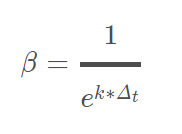

title: go-zero 默认的负载均衡算法 p2c+EWMA

### 背景
我们希望每次选择的节点都是负载最低的、响应最快的节点来处理我们的请求。在这里 go-zero 选择了 p2c+EWMA算法来实现。

### 采用的算法的中心思想
#### p2c
p2c(Pick Of 2 Choices)二选一: 在多个节点中随机选择两个节点。

go-zero 中的会随机的选择3次，如果其中一次选择的节点的健康条件满足要求，就中断选择，采用这两个节点。

#### EWMA
EWMA(Exponentially Weighted Moving-Average)指数移动加权平均法: 是指各数值的加权系数随时间呈指数递减，越靠近
当前时刻的数值加权系数就越大，体现了最近一段时间内的平均值。

 - 公式: 

    

 - 变量解释:
    + Vt: 代表的是第t次请求的 EWMA值
    + Vt-1: 代表的是第 t-1 次请求的 EWMA 值
    + β: 是一个常量
    
#### EWMA算法的优势
 1. 相较于普通的计算平均值算法，EWMA不需要保存过去所有的数值，计算量显著减少，同时也减小了存储资源。
 2. 传统的计算平均值算法对网络耗时不敏感, 而我们可以通过网络耗时来调节β，进而迅速监控到毛刺 或 更多的体现整体平均值
    - 当本次请求耗时较长, 我们就相应的调小β。β越小，EWMA值就越接近本次耗时，进而迅速监测到网络毛刺;
    - 当本次请求耗时较短, 我们就相对的调大β值。这样计算出来的EWMA值越接近平均值
    
##### β计算
go-zero 采用的是牛顿冷却定律中的衰减函数模型计算EWMA算法中的β值:



其中Δt为网络耗时，e，k为常数
### 简单介绍gRPC中实现自定义负载均衡器
 1. 首先我们需要实现 google.golang.org/grpc/balancer/base/base.go/PickerBuilder 接口, 这个接口主要是有服务节点更新的时候会调用接口里的方法
```go
type PickerBuilder interface {
    // Build returns a picker that will be used by gRPC to pick a SubConn.
    Build(info PickerBuildInfo) balancer.Picker
}
```
 2. 还要实现 google.golang.org/grpc/balancer/balancer.go/Picker 接口。这个接口主要实现负载均衡，挑选一个节点供请求使用
```go
type Picker interface {
	Pick(info PickInfo) (PickResult, error)
}
```
 3. 最后向负载均衡 map 中注册我们实现的负载均衡器

### 代码实现流程
#### 服务的所有节点信息保存起来
subConn 用来保存每个节点的信息
```go
type subConn struct {
    addr     resolver.Address
    conn     balancer.SubConn
    lag      uint64 // 用来保存 ewma 值
    inflight int64 // 用在保存当前节点正在处理的请求总数
    success  uint64 // 用来标识一段时间内此连接的健康状态
    requests int64 // 用来保存请求总数
    last     int64 // 用来保存上一次请求耗时, 用于计算 ewma 值
    pick     int64 // 保存上一次被选中的时间点
}
```
p2cPicker 实现了 balancer.Picker 接口
```go
type p2cPicker struct {
	conns []*subConn  // 保存所有节点的信息 
	r     *rand.Rand
	stamp *syncx.AtomicDuration
	lock  sync.Mutex
}
```
在 Build 方法中保存节点信息
```go
func (b *p2cPickerBuilder) Build(info base.PickerBuildInfo) balancer.Picker {
	readySCs := info.ReadySCs
	if len(readySCs) == 0 {
		return base.NewErrPicker(balancer.ErrNoSubConnAvailable)
	}
	var conns []*subConn
	for conn, connInfo := range readySCs {
		conns = append(conns, &subConn{
			addr:    connInfo.Address,
			conn:    conn,
			success: initSuccess,
		})
	}
	return &p2cPicker{
		conns: conns,
		r:     rand.New(rand.NewSource(time.Now().UnixNano())),
		stamp: syncx.NewAtomicDuration(),
	}
}
```

#### p2c 随机挑选两个节点信息
```go
switch len(p.conns) {
	case 0:
		return emptyPickResult, balancer.ErrNoSubConnAvailable
	case 1:
		chosen = p.choose(p.conns[0], nil)
	case 2:
		chosen = p.choose(p.conns[0], p.conns[1])
	default:
		var node1, node2 *subConn
        // 3次随机选择两个节点
		for i := 0; i < pickTimes; i++ {
			a := p.r.Intn(len(p.conns))
			b := p.r.Intn(len(p.conns) - 1)
			if b >= a {
				b++
			}
			node1 = p.conns[a]
			node2 = p.conns[b]
			// 如果这次选择的节点达到了健康要求, 就中断选择
			if node1.healthy() && node2.healthy() {
				break
			}
		}
		// 比较两个节点的负载情况，选择负载低的
		chosen = p.choose(node1, node2)
	}
```
计算节点的负载情况
```go
func (c *subConn) load() int64 {
	// 通过 EWMA 计算节点的负载情况
	lag := int64(math.Sqrt(float64(atomic.LoadUint64(&c.lag) + 1)))
	load := lag * (atomic.LoadInt64(&c.inflight) + 1)
	if load == 0 {
		return penalty
	}
	return load
}
```

#### 请求结束，更新节点的 EWMA 等信息
```go
func (p *p2cPicker) buildDoneFunc(c *subConn) func(info balancer.DoneInfo) {
	start := int64(timex.Now())
	return func(info balancer.DoneInfo) {
        // 正在处理的请求数减 1
		atomic.AddInt64(&c.inflight, -1)
		now := timex.Now()
        // 保存本次请求结束时的时间点，并取出上次请求时的时间点
		last := atomic.SwapInt64(&c.last, int64(now))
		td := int64(now) - last
		if td < 0 {
			td = 0
		}
        // 用牛顿冷却定律中的衰减函数模型计算EWMA算法中的β值
		w := math.Exp(float64(-td) / float64(decayTime))
        // 保存本次请求的耗时
		lag := int64(now) - start
		if lag < 0 {
			lag = 0
		}
		olag := atomic.LoadUint64(&c.lag)
		if olag == 0 {
			w = 0
		}
        // 计算 EWMA 值
		atomic.StoreUint64(&c.lag, uint64(float64(olag)*w+float64(lag)*(1-w)))
		success := initSuccess
		if info.Err != nil && !codes.Acceptable(info.Err) {
			success = 0
		}
		osucc := atomic.LoadUint64(&c.success)
		atomic.StoreUint64(&c.success, uint64(float64(osucc)*w+float64(success)*(1-w)))

		stamp := p.stamp.Load()
		if now-stamp >= logInterval {
			if p.stamp.CompareAndSwap(stamp, now) {
				p.logStats()
			}
		}
	}
}
```

学习自go-zero: [https://github.com/tal-tech/go-zero](https://github.com/tal-tech/go-zero)